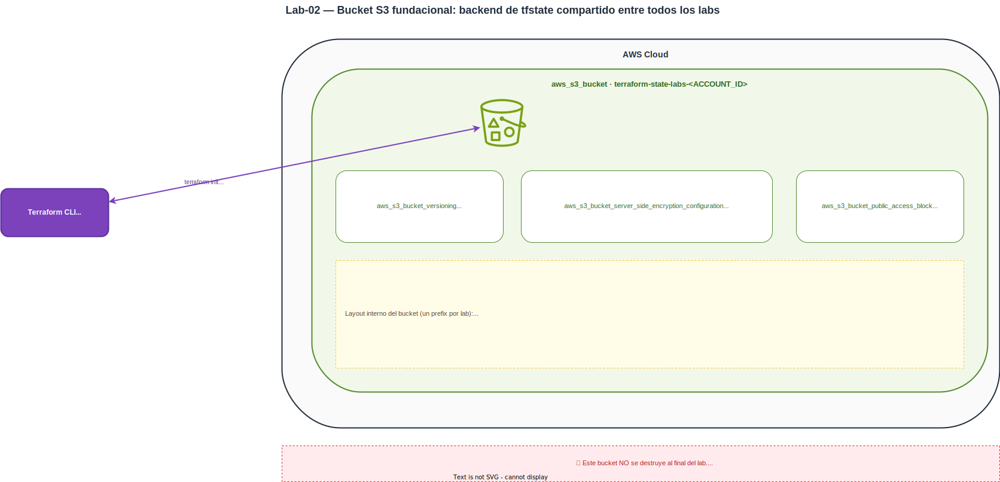

# Laboratorio 2 — Primer despliegue en AWS: bucket S3 con versionado y cifrado


[← Módulo 1 — Fundamentos de Infraestructura como Código y Terraform](../../modulos/modulo-01/README.md)


## Visión general

En este laboratorio crearás tu primer recurso de infraestructura en AWS usando Terraform: un bucket de Amazon S3 configurado como **backend de estado compartido para todos los laboratorios del curso**. Aprenderás el flujo de trabajo básico de Terraform (escribir, planificar y aplicar) e introducirás tres recursos de configuración de S3 que convierten el bucket en un almacén seguro y versionado.

> ⚠️ **Este bucket NO se destruye al finalizar el laboratorio.** Se reutilizará como backend remoto en el lab07 (state locking con DynamoDB) y en el lab10 (state splitting). Guarda el nombre que elijas: lo necesitarás en ambos laboratorios.

## Objetivos de Aprendizaje

Al finalizar este laboratorio serás capaz de:

- Entender la estructura básica de un archivo de configuración Terraform (`.tf`)
- Configurar el provider de AWS para entornos reales y locales
- Crear un bucket S3 y configurarlo con versionado, cifrado y bloqueo de acceso público
- Usar outputs para exponer información del recurso creado
- Verificar el estado de la infraestructura desde Terraform y desde AWS CLI

## Requisitos Previos

- Laboratorio 1 completado (entorno configurado)
---

## Conceptos Clave

### Bloque `terraform`

Define la configuración del propio Terraform: versión mínima requerida y los providers que se van a usar. Los providers son plugins que permiten a Terraform interactuar con APIs externas, en este caso la API de AWS.

```hcl
terraform {
  required_providers {
    aws = {
      source  = "hashicorp/aws"
      version = "~> 6.0"
    }
  }
}
```

El operador `~>` en la versión significa "compatible con": acepta cualquier versión `5.x` pero no la `6.0`. Esto evita actualizaciones de versión mayor que podrían introducir cambios incompatibles.

### Bloque `provider`

Configura el provider descargado. En el caso de AWS, el parámetro mínimo necesario es la región donde se crearán los recursos. Las credenciales se leen automáticamente del perfil configurado en AWS CLI (`~/.aws/credentials`).

```hcl
provider "aws" {
  region = "us-east-1"
}
```

### Bloque `resource`

Es el bloque central de Terraform. Define un recurso de infraestructura que Terraform debe crear y gestionar. Su sintaxis es:

```
resource "<TIPO_DE_RECURSO>" "<NOMBRE_LOCAL>" { ... }
```

- `<TIPO_DE_RECURSO>`: identifica el recurso en el provider (p. ej. `aws_s3_bucket`)
- `<NOMBRE_LOCAL>`: nombre interno usado para referenciar el recurso dentro del código Terraform; no tiene efecto en AWS

### Bloque `output`

Expone valores del recurso creado una vez que Terraform termina de aplicar los cambios. Son útiles para visualizar información relevante sin tener que consultar la consola de AWS, y también para pasar datos entre módulos en configuraciones más avanzadas.

---

## Flujo de Trabajo de Terraform

Todo despliegue con Terraform sigue tres pasos fundamentales:

| Paso | Comando | Descripción |
|---|---|---|
| Inicializar | `terraform init` | Descarga los providers y prepara el directorio de trabajo |
| Planificar | `terraform plan` | Calcula qué cambios se realizarán sin aplicarlos |
| Aplicar | `terraform apply` | Ejecuta los cambios y actualiza el estado |

### El archivo de estado (`terraform.tfstate`)

Cuando ejecutas `terraform apply`, Terraform genera un archivo `terraform.tfstate` en el directorio de trabajo. Este archivo es el registro de qué recursos existen y cuál es su configuración actual. Terraform lo usa para calcular las diferencias en cada `plan` y para saber qué destruir en un `destroy`.

> En entornos de equipo, el estado se almacena en un backend remoto (como S3 + DynamoDB) para que todos los miembros trabajen con el mismo estado. En el lab07 aprenderás a migrar el estado local a S3 usando el bucket que creas en este laboratorio.

---

## Estructura del proyecto

```
lab02/
├── aws/
│   └── main.tf       # Bucket S3 + versionado + cifrado + acceso público bloqueado
└── localstack/
    └── main.tf       # Configuración idéntica apuntando a LocalStack
```

Cada subdirectorio es un proyecto Terraform independiente con su propio estado. Esto permite trabajar con ambos entornos de forma aislada.

---

## Arquitectura



> Fuente editable: [`diagrama.drawio`](diagrama.drawio) — abrir con la extensión
> [Draw.io Integration](https://marketplace.visualstudio.com/items?itemName=hediet.vscode-drawio)
> de VS Code o en [app.diagrams.net](https://app.diagrams.net).

Un único bucket `terraform-state-labs-<ACCOUNT_ID>` con tres recursos de configuración:
- `aws_s3_bucket_versioning` (Enabled) — base para la recuperación de estado del lab-11.
- `aws_s3_bucket_server_side_encryption_configuration` (AES256) — cifrado at-rest.
- `aws_s3_bucket_public_access_block` (4 flags `true`) — defensa contra exposición accidental.

Cada lab posterior usa un prefijo distinto dentro del bucket (`lab07/...`, `lab10/network/...`, etc.) como `key` del backend S3. **No destruyas este bucket al final del lab** — es un recurso compartido del que dependen el resto de laboratorios.

---

## 1. Creación del Bucket en AWS Real

### 1.1 Código Terraform

**`aws/main.tf`**

```hcl
resource "aws_s3_bucket" "state" {
  bucket = "terraform-state-labs-<ACCOUNT_ID>"

  tags = {
    ManagedBy = "terraform"
    Purpose   = "terraform-state"
  }
}

resource "aws_s3_bucket_versioning" "state" {
  bucket = aws_s3_bucket.state.id

  versioning_configuration {
    status = "Enabled"
  }
}

resource "aws_s3_bucket_public_access_block" "state" {
  bucket = aws_s3_bucket.state.id

  block_public_acls       = true
  block_public_policy     = true
  ignore_public_acls      = true
  restrict_public_buckets = true
}

resource "aws_s3_bucket_server_side_encryption_configuration" "state" {
  bucket = aws_s3_bucket.state.id

  rule {
    apply_server_side_encryption_by_default {
      sse_algorithm = "AES256"
    }
  }
}
```

Puntos a destacar de esta configuración:

- El argumento `bucket` define el nombre del bucket en S3. Los nombres son **globalmente únicos** en toda AWS, por lo que es necesario añadir un sufijo diferenciador. Reemplaza `<ACCOUNT_ID>` con tu ID de cuenta AWS (se puede obtener con `aws sts get-caller-identity --query Account --output text`).
- `aws_s3_bucket_versioning`: cada `terraform apply` genera una nueva **versión** del estado en lugar de sobreescribir la anterior. Esto permite recuperar versiones anteriores ante un error.
- `aws_s3_bucket_public_access_block`: el estado de Terraform puede contener secretos (contraseñas, claves privadas) y nunca debe ser accesible públicamente. Este recurso bloquea todos los mecanismos de acceso público de S3.
- `aws_s3_bucket_server_side_encryption_configuration`: cifra todos los objetos del bucket con AES-256 en reposo.

### 1.2 Despliegue

Obtén tu ID de cuenta y guárdalo en una variable de entorno:

```bash
export ACCOUNT_ID=$(aws sts get-caller-identity --query Account --output text)
echo $ACCOUNT_ID
```

Edita `aws/main.tf` y reemplaza `<ACCOUNT_ID>` con el valor obtenido. Luego, desde el directorio `lab02/aws/`:

**Paso 1 — Inicializar**

```bash
terraform init
```

Este comando descarga el provider `hashicorp/aws` desde el registro público de Terraform y crea el directorio `.terraform/`. Solo es necesario ejecutarlo una vez por proyecto, o cuando se añaden nuevos providers.

**Paso 2 — Planificar**

```bash
terraform plan
```

Terraform compara la configuración deseada con el estado actual (vacío en este caso) y muestra los cambios que realizará:

```
Plan: 4 to add, 0 to change, 0 to destroy.
```

Los cuatro recursos son el bucket y sus tres configuraciones (versionado, acceso público bloqueado y cifrado).

**Paso 3 — Aplicar**

```bash
terraform apply
```

Terraform mostrará el plan de nuevo y pedirá confirmación. Escribe `yes` para continuar.

### 1.3 Verificación

Al finalizar `terraform apply`, Terraform mostrará los outputs definidos:

```
Apply complete! Resources: 4 added, 0 changed, 0 destroyed.

Outputs:

bucket_arn    = "arn:aws:s3:::terraform-state-labs-123456789012"
bucket_name   = "terraform-state-labs-123456789012"
bucket_region = "us-east-1"
```

Puedes consultar los outputs en cualquier momento sin volver a aplicar cambios:

```bash
terraform output
terraform output -raw bucket_name
```

Verifica desde AWS CLI que el bucket existe y tiene versionado activo:

```bash
aws s3 ls
aws s3api get-bucket-versioning --bucket terraform-state-labs-$ACCOUNT_ID
```

Resultado esperado del versionado:

```json
{
    "Status": "Enabled"
}
```

Confirma que el cifrado está activo:

```bash
aws s3api get-bucket-encryption --bucket terraform-state-labs-$ACCOUNT_ID
```

### 1.4 Nota: Este Bucket NO Se Destruye

> ⚠️ **No ejecutes `terraform destroy` en este laboratorio.** El bucket `terraform-state-labs-<ACCOUNT_ID>` se usará como backend remoto de Terraform en posteriores laboratorios:
> Si lo destruyes accidentalmente, vuelve a ejecutar `terraform apply` para recrearlo antes de continuar con los laboratorios siguientes.

---

## Verificación final

```bash
BUCKET="terraform-state-labs-$(aws sts get-caller-identity --query Account --output text)"

# Verificar que el bucket fue creado
aws s3 ls | grep "${BUCKET}"

# Verificar que el versionado esta habilitado
aws s3api get-bucket-versioning \
  --bucket "${BUCKET}" \
  --query 'Status'
# Esperado: "Enabled"

# Verificar que el acceso publico esta bloqueado
aws s3api get-public-access-block \
  --bucket "${BUCKET}" \
  --query 'PublicAccessBlockConfiguration'

# Verificar el cifrado AES-256
aws s3api get-bucket-encryption \
  --bucket "${BUCKET}" \
  --query 'ServerSideEncryptionConfiguration.Rules[0].ApplyServerSideEncryptionByDefault.SSEAlgorithm'
# Esperado: "AES256"
```

---

## 2. Comparativa AWS Real vs LocalStack

| Aspecto | AWS Real | LocalStack |
|---|---|---|
| Credenciales | Credenciales IAM reales | `test` / `test` |
| Endpoint | Por defecto (AWS) | `http://localhost.localstack.cloud:4566` |
| Nombre del bucket | `terraform-state-labs-<ACCOUNT_ID>` (globalmente único) | `terraform-state-labs` (solo único en LocalStack) |
| Versionado S3 | Historial real de versiones | Soportado |
| Cifrado AES-256 | Cifrado real en reposo | Simulado |
| Public Access Block | Protección real | Soportado |
| Persistencia | Permanente (se reutiliza en posteriores Labs) | Se pierde al detener el contenedor |
| `terraform destroy` | **No ejecutar** | Opcional |

---

## 3. LocalStack

Este laboratorio puede ejecutarse íntegramente en LocalStack. Consulta [localstack/README.md](localstack/README.md) para las instrucciones de despliegue local.

---

## Buenas prácticas aplicadas

- **No hardcodees credenciales** en los archivos `.tf`. Usa perfiles de AWS CLI o variables de entorno.
- **No subas `terraform.tfstate` a un repositorio público.** Puede contener información sensible sobre tu infraestructura. Añádelo al `.gitignore`.
- **Activa el versionado antes de usar el bucket como backend.** Ya lo hemos hecho en este laboratorio. El versionado garantiza que puedes recuperar cualquier versión anterior del estado ante un `apply` erróneo.
- **Bloquea el acceso público en buckets de estado.** El estado puede contener valores `sensitive` como contraseñas o claves privadas.
- **Usa `terraform plan` siempre** antes de `terraform apply` en entornos reales para revisar los cambios.

---

## Recursos

- [Recurso aws_s3_bucket en Terraform](https://registry.terraform.io/providers/hashicorp/aws/latest/docs/resources/s3_bucket)
- [Recurso aws_s3_bucket_versioning](https://registry.terraform.io/providers/hashicorp/aws/latest/docs/resources/s3_bucket_versioning)
- [Recurso aws_s3_bucket_public_access_block](https://registry.terraform.io/providers/hashicorp/aws/latest/docs/resources/s3_bucket_public_access_block)
- [Recurso aws_s3_bucket_server_side_encryption_configuration](https://registry.terraform.io/providers/hashicorp/aws/latest/docs/resources/s3_bucket_server_side_encryption_configuration)
- [Documentación de Amazon S3](https://docs.aws.amazon.com/s3/)
- [Soporte S3 en LocalStack](https://docs.localstack.cloud/aws/services/s3/)
- [Comandos de Terraform CLI](https://developer.hashicorp.com/terraform/cli/commands)
- [Gestión del estado en Terraform](https://developer.hashicorp.com/terraform/language/state)
